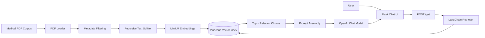

# Medical Chatbot with LLM

Retrieval-augmented medical question answering system built with Flask, LangChain, Pinecone, Hugging Face embeddings, and OpenAI.

<!--
Recruiter note:
Keep the first screen concise. The title, one-line description, badges, demo link,
and a strong architecture signal should be visible without scrolling too far.
-->


> This project demonstrates an end-to-end RAG workflow: PDF ingestion, semantic chunking, vector indexing, context retrieval, and grounded LLM response generation through a lightweight web interface.

## About

Medical Chatbot with LLM is an AI-powered question-answering application that uses retrieval-augmented generation to provide concise responses from a medical PDF knowledge base. It combines semantic search, vector storage, and LLM-based generation to demonstrate how domain-specific assistants can be built with grounded context instead of relying only on model memory.

<!--
## Demo & Screenshots


Add a deployed URL when available. Good options: Render, Railway, Fly.io, Azure App Service,
AWS Elastic Beanstalk, or a Dockerized VM deployment.


**Live demo:** `https://your-deployment-url.example.com`

<!--
Recommended screenshot names:
- docs/screenshots/chat-interface.png
- docs/screenshots/rag-flow.png
- docs/screenshots/pinecone-index.png


| Chat Interface | Retrieval Flow |
| --- | --- |
|  |  | 
-->

## Problem Statement

Medical information is often stored in long-form PDFs, textbooks, manuals, and clinical reference material. Traditional keyword search can miss relevant context, while a standalone LLM may answer confidently without grounding.

This project solves the engineering challenge of building a domain-aware assistant that retrieves relevant passages from a curated medical knowledge base before generating a concise answer. The goal is not to replace professional medical advice, but to demonstrate how RAG can improve answer grounding, traceability, and system control in a high-risk information domain.

<!--
Customize this section with the specific source material, target user, and safety boundaries.
Example: "The first indexed corpus is a medical textbook PDF stored in /data."
-->

## Features

- PDF document ingestion from a local data directory.
- Recursive text chunking optimized for semantic retrieval.
- Hugging Face `sentence-transformers/all-MiniLM-L6-v2` embeddings.
- Pinecone serverless vector index with cosine similarity search.
- LangChain retrieval chain with top-k contextual grounding.
- OpenAI chat model integration for concise answer generation.
- Flask-based web chat interface.
- Dockerfile for containerized execution.

## Architecture

<!--
Recommended architecture diagram format:
Use Mermaid for GitHub-native rendering, then add a polished exported PNG later
if you want a more visual recruiter-facing diagram.
-->



### Major Components

<!--
Use this section to show that you understand the system boundaries and data flow.
Keep it implementation-oriented and avoid vague product language.
-->

- **Ingestion pipeline:** `store_index.py` loads PDFs from `data/`, removes unnecessary metadata, chunks the text, embeds each chunk, and writes vectors to Pinecone.
- **Embedding layer:** `src/helper.py` uses `all-MiniLM-L6-v2`, producing 384-dimensional embeddings suitable for the configured Pinecone index.
- **Vector retrieval:** `app.py` connects to an existing Pinecone index and retrieves the top 3 semantically similar chunks for each user query.
- **Generation layer:** LangChain combines retrieved documents with a strict system prompt and sends the final prompt to OpenAI.
- **Presentation layer:** Flask serves the chat page and handles asynchronous form submissions from the browser.

## Tech Stack

| Layer | Technology | Purpose |
| --- | --- | --- |
| Backend | Flask | Web server and chat endpoint |
| LLM Orchestration | LangChain | Retrieval and document-combination chains |
| LLM | OpenAI `gpt-4o` | Response generation |
| Embeddings | Hugging Face Sentence Transformers | Semantic representation of document chunks |
| Vector Database | Pinecone Serverless | Similarity search and vector storage |
| Document Processing | PyPDF, LangChain loaders | PDF extraction and chunk preparation |
| Frontend | HTML, Bootstrap, jQuery | Browser chat interface |
| Configuration | python-dotenv | Local environment variable loading |
| Deployment | Docker | Containerized application runtime |

## Technical Highlights

<!--
Replace placeholder metrics with real measurements where possible.
Recruiters respond well to concrete numbers: latency, index size, chunk count,
retrieval quality, token cost, and deployment constraints.
-->

- **RAG-first design:** Answers are generated from retrieved context instead of relying only on model memory.
- **Vector retrieval:** Pinecone similarity search enables semantic matching beyond exact keyword overlap.
- **Controlled prompt behavior:** The system prompt instructs the assistant to stay concise and say when it does not know.
- **Separation of ingestion and serving:** Index creation is handled separately from runtime chat serving, reducing startup complexity.
- **Cloud-ready indexing:** Pinecone serverless is configured for AWS `us-east-1` with cosine distance and 384-dimensional vectors.
- **Containerized runtime:** Docker support makes the service easier to run consistently across local and hosted environments.

Potential production extensions:

- Add response streaming for lower perceived latency.
- Add retrieval evaluation with curated question-answer pairs.
- Add caching for repeated questions and embedding calls.
- Add request validation, rate limiting, and observability.
- Add source citations in responses for stronger auditability.

## Challenges & Learnings

<!--
Use this section to communicate engineering maturity. Good READMEs explain tradeoffs,
not just tools. Mention what you considered, what you chose, and why.
-->

- **Chunk size tradeoff:** Smaller chunks improve retrieval precision but can remove context; larger chunks preserve context but may reduce search specificity. This implementation uses compact chunks to keep retrieved context focused.
- **Embedding model choice:** `all-MiniLM-L6-v2` is lightweight and cost-effective, but larger medical or domain-specific embedding models may improve recall for specialized terminology.
- **Grounding vs. fluency:** The generation layer must balance concise answers with enough context to be useful. The prompt currently favors short responses to reduce hallucination risk.
- **Operational separation:** Running ingestion separately from the web app keeps runtime simpler, but production systems should add index versioning and repeatable ingestion jobs.
- **Safety boundary:** Medical chatbot systems require careful disclaimers, evaluation, and escalation patterns before real-world use.

## Setup Instructions

### Prerequisites

- Python 3.10+
- Pinecone account and API key
- OpenAI API key
- A PDF corpus in the `data/` directory

### 1. Clone the Repository

```bash
git clone https://github.com/<your-username>/Medical-Chatbot-with-LLM.git
cd Medical-Chatbot-with-LLM
```

### 2. Create a Virtual Environment

```bash
python -m venv .venv
source .venv/bin/activate
```

For Windows PowerShell:

```powershell
python -m venv .venv
.\.venv\Scripts\Activate.ps1
```

### 3. Install Dependencies

```bash
pip install -r requirements.txt
```

### 4. Configure Environment Variables

Create a `.env` file in the project root:

```env
PINECONE_API_KEY=your_pinecone_api_key
OPENAI_API_KEY=your_openai_api_key
```

<!--
Never commit real API keys. If you include a .env.example file later,
keep only placeholder values.
-->

### 5. Build the Vector Index

Place your medical PDF files inside `data/`, then run:

```bash
python store_index.py
```

This creates or reuses the `medical-chatbot` Pinecone index and uploads embedded document chunks.

### 6. Run the Application

```bash
python app.py
```

The app runs locally at:

```text
http://localhost:8080
```

## Docker Setup

Build the image:

```bash
docker build -t medical-chatbot-llm .
```

Run the container:

```bash
docker run --env-file .env -p 8080:8080 medical-chatbot-llm
```

<!--
For production deployments, consider adding Gunicorn, health checks,
non-root container execution, and explicit dependency caching.
-->

## API Endpoints

| Method | Endpoint | Description |
| --- | --- | --- |
| `GET` | `/` | Serves the chat interface |
| `POST` | `/get` | Accepts a user message and returns a generated answer |

Example request:

```bash
curl -X POST http://localhost:8080/get \
  -H "Content-Type: application/x-www-form-urlencoded" \
  -d "msg=What are the symptoms of diabetes?"
```

Example response:

```text
Diabetes symptoms may include increased thirst, frequent urination, fatigue, blurred vision, and unexplained weight loss. Please consult a qualified medical professional for diagnosis or treatment.
```

## Future Improvements

<!--
Roadmap items should sound like engineering backlog, not wish-list features.
When implemented, link each item to a PR, issue, or commit.
-->

- Add cited source snippets and page references to each answer.
- Add `/health` and `/ready` endpoints for deployment platforms.
- Add structured logging and request tracing.
- Add automated tests for ingestion, retrieval, and endpoint behavior.
- Add evaluation datasets for retrieval recall and answer faithfulness.
- Add streaming responses with Server-Sent Events or WebSockets.
- Add authentication and per-user rate limits.
- Add CI pipeline for linting, testing, and Docker image validation.


<!--

## Screenshot Strategy
Use this strategy to make the repository visually credible without turning the README
into a marketing page.


Recommended screenshots:

1. **Primary chat UI:** Show a realistic medical question and a concise grounded answer.
2. **Architecture diagram:** Export the Mermaid diagram or create a clean diagram in Excalidraw, Mermaid, or draw.io.
3. **Vector database evidence:** Include a Pinecone dashboard screenshot showing index dimensions, metric, and vector count.
4. **Terminal workflow:** Optional screenshot of successful ingestion or app startup.

Image guidelines:

- Store screenshots in `docs/screenshots/`.
- Use descriptive filenames.
- Avoid screenshots that expose API keys, local usernames, or private data.
- Prefer light annotations over heavy visual decoration.

## Architecture Diagram Guidance

For GitHub, Mermaid is the simplest maintainable option. For portfolio or LinkedIn sharing, export a PNG/SVG version with the same structure:

- Left side: data ingestion pipeline.
- Center: vector storage and retrieval.
- Right side: runtime chat request flow.
- Bottom: external services such as OpenAI and Pinecone.

Keep the diagram focused on system boundaries, not every function call.

## Recruiter-Ready Project Tips

<!--
This section is intentionally reusable. Keep it near the bottom so the README remains
project-first while still helping future maintainers polish the repository.
--

- Add a real deployment link if the project can be safely hosted.
- Add a short demo video or GIF under 60 seconds.
- Replace placeholders with measurable facts: chunk count, average latency, index size, evaluation score, or test coverage.
- Add a `docs/architecture.md` file if the system grows beyond one README diagram.
- Add a `.env.example` file with safe placeholder variables.
- Add CI status badges only after CI is actually configured.
- Keep commit history clean and use PR-style descriptions for major changes.
- Mention tradeoffs clearly; mature engineers explain constraints, not only outcomes.

-->

## Contributing

Contributions are welcome. Please open an issue first for major changes so the implementation approach can be discussed before code is written.

Suggested workflow:

```bash
git checkout -b feature/your-feature-name
pip install -r requirements.txt
python store_index.py
python app.py
```

Before opening a pull request, verify that:

- The app starts successfully.
- No secrets are committed.
- New behavior is documented.
- Any new dependencies are justified.

## License

This project is licensed under the Apache License 2.0. See [LICENSE](LICENSE) for details.

## Medical Disclaimer

This application is an engineering demonstration and is not a medical device. It should not be used for diagnosis, treatment, or emergency medical decisions. Always consult a qualified healthcare professional for medical advice.
